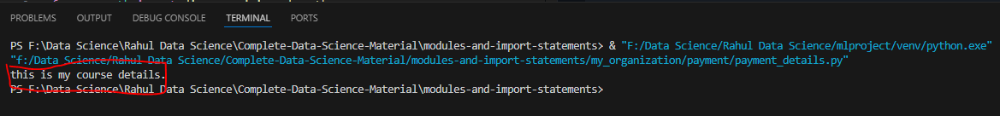

# Modules and Packages in Python

Welcome to the "Modules and Packages" class in Python! In this class, you will learn about modules, packages, and how to import statements from one module to another or from one package to another.

## What is a Module?

A module in Python is a file containing Python definitions and statements. The file name is the module name with the suffix `.py` appended. Within a module, you can define functions, classes, and variables. Modules allow you to organize your code logically and reuse it in other Python programs.

## What is a Package?

A package in Python is a way of organizing related modules. It consists of a directory containing a special file called `__init__.py`, which may contain initialization code for the package. Packages help in organizing and managing large Python projects by providing a hierarchical structure.

## Import Statements

This is the directory heirarchy we are following:
```
my_organization/
│
├── course/
│   └── course.py
|       └── course_details()
│
└── payment/
    └── payment.py
        └── payment_details()
```

### Problem Statement
We are going to import modules from `course_details` to `payment_details` and vise-versa.


### Importing from `payment_details.py` to `course_details.py`

To import a module into another module, you can use the `import` statement followed by the module name. For example:

```python
# 'my_organization/course/course_details.py'

# Importing module1 into module2
from payment import payment_details

def course():
    print("this is my course file")

payment_details.payment()
```

once we imported it, Let's try to execute it with this following comman in terminal

```
python course.py
```

We got error: ModuleNotFoundError: No module named 'payment'


We can see the payment directory is present and `payment_detail.py` also present in it, then we are unable to call that `payment` function in `course.py`

#### What is the reason behind this error?

Reason is that this is basically `payment_detail.py` is untracked file. mean it is available in multiple folders (means folder inside a folder inside a folder..) and then this file is available, so `course.py` is not able to locate this file at the time of exection. While coding it is able to locate but at the time execition unable to locate.

This kind of error is very likely to occure in most of cases. sometimes it doesn't occur

#### How to solve it?

Simply by collapsing all the file path. so that everyone will be aware of other. right, by creating a cache we will be able to solve this perticular situation.

To solve this will add few lines of code as follows

```python

import os, sys
from os.path import dirname, join, abspath

sys.path.insert(0,abspath(join(dirname(__file__), '..')))

```
insert takes two parametrs index, object
index : 0 , means just collaps everything at zero'th indexes

object: abspath(join(dirname(__file__), '..')), as an object will try to pass absolute path

this is the final `course.py` file will look like after adding this code

```python
# 'my_organization/course/course_details.py'

import os, sys
from os.path import dirname, join, abspath

sys.path.insert(0,abspath(join(dirname(__file__), '..')))

# Importing module1 into module2
from payment import payment_details

def course():
    print("this is my course file")

payment_details.payment()
```

Executing again
```
python course.py
```

We got successful execution: this is my payment file


### Importing from `course_details.py` to `payment_details.py`

Now, after importing from payment to course if we perform course to payment importing it will become a circular import which is going to give us circular error. because we have already done this payment ot course import, so to make it work we have to comment those import's from `course.py` and then procced further.
After commenting this is how `course.py` look a like

```python
# 'my_organization/course/course_details.py'

# Importing module1 into module2
#from payment import payment_details // commented

def course():
    print("this is my course file")

#payment_details.payment() // commented
```
from here will procced:

```python
# 'my_organization/payment/payment_details.py'
import os, sys
from os.path import dirname, join, abspath

sys.path.insert(0,abspath(join(dirname(__file__), '..')))

# Importing course into payment
from course import course_details

def payment():
    print("this is my payment file")

course_details.course()
```

Executing program
```
python payment.py
```

We got successful execution: this is my course details




